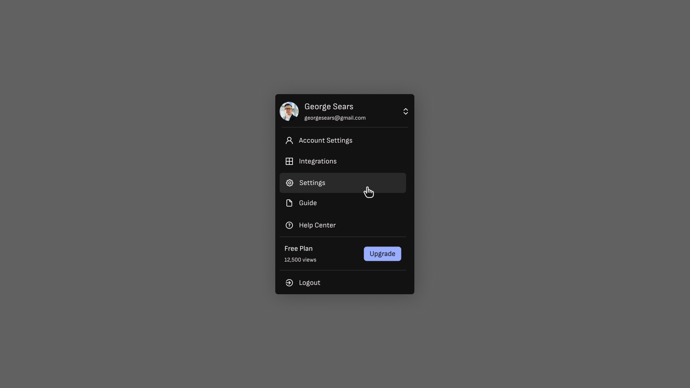
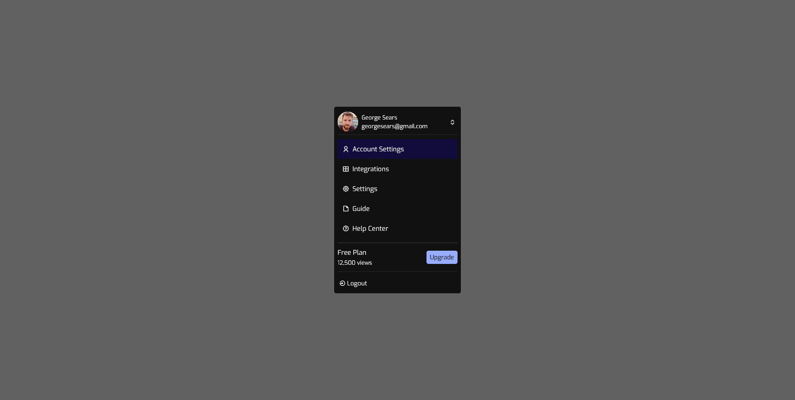

# Dropdown Menu - WebDevDaily 

This is a solution to [Dropdown Menu](https://www.webdevdaily.io/challenges/dropdown-menu-277) on [Webdevdaily.io](https://www.webdevdaily.io/) website.

## Objective

Convert this design to code, attempting to get it as close as possible using HTML, CSS and JavaScript.

## Design

## Screenshot

## Demo

- Github Pages: [Github Pages]()

## Useful Resources 
- [Remix icons](https://remixicon.com/) - Icon pack I used
- [Coolors - Constrast Checker](https://coolors.co/contrast-checker/) - Checks the constrast between two colors 
- [Google webfonts helper](https://gwfh.mranftl.com/fonts) - Free way to self-host Google Fonts 